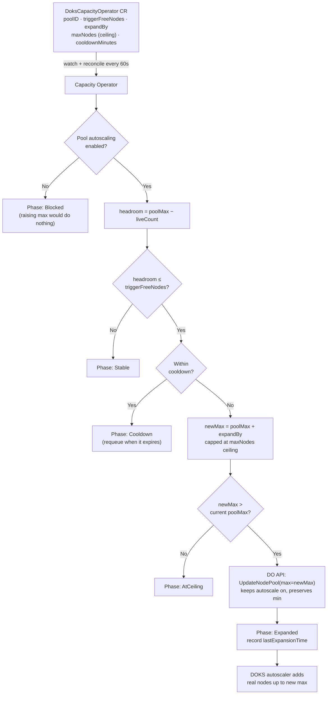

<div align="center">

# 🌊 DOKS Capacity Operator

**A tiny Kubernetes operator that keeps your DigitalOcean node pool's autoscale ceiling one step ahead of demand — automatically, gradually, and with guardrails.**

[](https://go.dev)
[](https://kubernetes.io)
[](https://www.digitalocean.com/products/kubernetes)
[](https://www.apache.org/licenses/LICENSE-2.0)
[](https://book.kubebuilder.io)

</div>

---

## The problem in one breath

DigitalOcean's cluster autoscaler does a great job of adding and removing nodes — **right up until it hits the node pool's `max`.** That `max` is a hard ceiling you set once. The day your workload outgrows it, pods go `Pending`, the autoscaler shrugs, and someone gets paged to bump a number in the dashboard by hand.

**The DOKS Capacity Operator removes that someone.**

It watches your node pool and, when free headroom runs low, it raises the pool's autoscale `max` by a small step — never past a hard ceiling you control, never faster than a cooldown you set. The DigitalOcean autoscaler then does what it already does best: add the actual nodes.

Think of it as **an autoscaler for your autoscaler's ceiling.**

---

## Why not just set `max` high and forget it?

You could set `max: 100` on day one. But then a runaway Deployment, a bad rollout, or a traffic spike can scale you straight to 100 nodes — and to a surprise invoice — in minutes.

This operator gives you the middle path:

| Approach | Behaviour |
|---|---|
| **Fixed low `max`** | Safe on cost, but you hit the wall and pods stay `Pending`. Manual bumps forever. |
| **Fixed high `max`** | Never hit the wall, but any runaway workload scales straight to the top. |
| **DOKS Capacity Operator** | The effective ceiling tracks demand: it creeps up `expandBy` nodes at a time, no faster than `cooldownMinutes`, and **never past your hard `maxNodes` ceiling.** Bounded, gradual, observable. |

You get a *graduated capacity ramp with a circuit breaker* instead of a binary choice between "too small" and "wide open."

---

## Features

- 🪜 **Graduated expansion** — raises the pool max in small `expandBy` steps as headroom shrinks.
- 🧱 **Hard ceiling** — never raises the pool max above your `maxNodes` value (DO caps pools at 100).
- ⏳ **Cooldown** — enforces a minimum gap between expansions so you don't flap.
- 🔍 **Auto-discovery** — give it a `poolID` *or* a `poolName` and it finds the cluster for you.
- 🛑 **Autoscale-aware** — if the pool's own autoscaling is off, it refuses to act (raising a max nobody reads is pointless) and tells you why.
- 👀 **Observable** — rich status phases, `Ready` conditions, `kubectl` printer columns, and a Prometheus metrics endpoint.
- 🪶 **Featherweight** — `10m` CPU / `32Mi` memory requested. It does almost nothing, almost all of the time.
- 📦 **GitOps-native** — it's a CRD. Commit a YAML, let the controller reconcile.

---

## How it works



In plain English, every 60 seconds the operator:

1. **Resolves the pool** — directly if you gave it `clusterID` + `poolID`, otherwise by scanning the clusters your token can see and matching on `poolID`/`poolName`.
2. **Records observed state** to `status` (resolved IDs, live node count, current pool max).
3. **Checks autoscaling** — if it's disabled on the pool, it stops and reports `Blocked`.
4. **Measures headroom** = `poolMax − count`. Plenty of room → `Stable`, done.
5. **Respects the cooldown** — if the trigger fired but the last expansion was too recent, it waits (`Cooldown`) and requeues exactly when the window opens.
6. **Expands** — computes `poolMax + expandBy`, clamps it to the `maxNodes` ceiling, and if that's actually higher than today's max, calls the DigitalOcean API to raise it. Phase becomes `Expanded`. If it's already at the ceiling, `AtCeiling`.

The operator only ever touches the **max**. It keeps autoscaling on and preserves your `min`. The real node add/remove decisions stay with DigitalOcean's autoscaler.

---

## Quick start

### Prerequisites

- A running **DOKS** cluster with **autoscaling enabled** on the target node pool
- A **DigitalOcean API token** with read/write Kubernetes scope
- `kubectl` pointed at the cluster
- `Go 1.22+`, `Docker`, and `make` for building
- *(optional)* [`kubeseal`](https://github.com/bitnami-labs/sealed-secrets) if you want to commit the token as a SealedSecret

### 1. Build & push the image

```bash
make docker-build docker-push IMG=<your-registry>/doks-capacity-operator:0.1.0
```

### 2. Install the CRD

```bash
make install
```

### 3. Provide the DigitalOcean token

The controller reads it from a secret named `doks-do-token` (key `token`) in the `doks-system` namespace:

```bash
kubectl create namespace doks-system

kubectl create secret generic doks-do-token \
  --namespace doks-system \
  --from-literal=token="<YOUR_DO_API_TOKEN>"
```

> 💡 **GitOps tip:** the repo ships a SealedSecret stub at `release/`. Encrypt your token with `kubeseal` and commit the result instead of the plaintext secret above — see the comment block in `release/release.yaml` for the exact command.

### 4. Deploy the controller

```bash
make deploy IMG=<your-registry>/doks-capacity-operator:0.1.0
```

…or apply the bundled all-in-one manifest (remember to set your real image and `imagePullSecrets` first):

```bash
kubectl apply -f release/release.yaml
```

### 5. Tell it which pool to watch

```yaml
# config/samples/dokscapacityoperator.yaml
apiVersion: platform.mahy.love/v1alpha1
kind: DoksCapacityOperator
metadata:
  name: dokscapacityoperator-sample
spec:
  # No clusterID — the operator discovers it from the pool.
  poolID: "your-pool-uuid"   # or use poolName: "chat-pool"
  triggerFreeNodes: 3        # expand when only 3 nodes of headroom remain
  expandBy: 5                # add 5 to the pool's autoscale max each time
  maxNodes: 20               # HARD CEILING — never raise the pool max above 20
  cooldownMinutes: 15        # wait 15 min between expansions
```

```bash
kubectl apply -f config/samples/dokscapacityoperator.yaml
```

### 6. Watch it work

```bash
kubectl get oco
```

```text
NAME                          POOL                   COUNT   MAX   CEILING   PHASE
dokscapacityoperator-sample   a1b2c3d4-...-pool      8       10    20        Stable
```

---

## Configuration reference

`spec` fields of a `DoksCapacityOperator`:

| Field | Type | Required | Default | Description |
|---|---|:---:|:---:|---|
| `clusterID` | string | – | – | DO cluster UUID. Leave empty to auto-discover from the pool. |
| `poolID` | string | one of these² | – | DO node pool UUID. **Preferred** — globally unique. |
| `poolName` | string | one of these² | – | Node pool name. Used only when `poolID` is empty. |
| `triggerFreeNodes` | int | ✅¹ | `3` | Expand when `(poolMax − count) ≤ this`. |
| `expandBy` | int | ✅¹ | `5` | Nodes added to the pool's autoscale max per expansion. |
| `maxNodes` | int | ✅ | – | **Hard ceiling.** Pool max is raised up to but never above this. Range `1–100`. |
| `cooldownMinutes` | int | ✅¹ | `15` | Minimum minutes between two expansions. |

> ¹ Required by the schema, but has a default, so you can omit it.
> ² At least one of `poolID` / `poolName` must be set (enforced by the controller).

### Status phases

| Phase | Meaning |
|---|---|
| `Stable` | Enough headroom; nothing to do. |
| `Cooldown` | Trigger hit, but waiting out the cooldown window. |
| `Expanded` | Just raised the pool's autoscale max. |
| `AtCeiling` | Pool max is at/above the hard ceiling — won't raise further. |
| `Blocked` | Pool autoscaling is disabled, so raising the max would be a no-op. |
| `Error` | An API call or pool resolution failed (see `.status.message`). |

Every reconcile also sets a standard `Ready` condition you can wait on in scripts:

```bash
kubectl wait oco/dokscapacityoperator-sample \
  --for=condition=Ready --timeout=120s
```

---

## Local development

Run the controller against your current kubeconfig without deploying anything:

```bash
export DIGITALOCEAN_TOKEN="<YOUR_DO_API_TOKEN>"
make install        # CRDs into the cluster
make run            # runs the manager locally
```

Other handy targets:

```bash
make manifests      # regenerate CRD + RBAC from kubebuilder markers
make generate       # regenerate deepcopy code
make test           # run unit tests (DO client is faked behind an interface)
make build          # compile the binary into ./bin
```

The DigitalOcean surface the controller needs is captured in a small `DOClient` interface, so the reconciler is fully unit-testable with a fake — no live API calls in tests.

---

## Project layout

```text
doks-capacity-operator/
├── api/v1alpha1/        # CRD types (DoksCapacityOperatorSpec/Status)
├── cmd/                 # manager entrypoint (main.go)
├── internal/
│   ├── controller/      # the reconcile loop
│   └── do/              # thin godo wrapper: ResolvePool, SetMaxNodes
├── config/              # kustomize bases (CRD, RBAC, manager, samples)
├── release/             # all-in-one release.yaml + SealedSecret stub
├── test/                # e2e + integration tests
├── Dockerfile
└── Makefile
```

---

## Caveats & honest limitations

- **It manages the ceiling, not the nodes.** Actual scaling is still DigitalOcean's autoscaler. If pod scheduling is blocked by something other than node count (taints, resource requests, quotas), raising the max won't help.
- **Gradual, not instant.** With `expandBy: 5` and `cooldownMinutes: 15`, a sustained spike still climbs over time. That's the point — but size `expandBy`/`cooldown` for your real burst profile.
- **The hard ceiling is your safety net — set it deliberately.** This operator only protects you from *runaway speed*, not from a high ceiling you chose.
- **One pool per CR.** Create one `DoksCapacityOperator` resource per node pool you want managed.

### Before you deploy `release/release.yaml`

The bundled manifest ships with two placeholders you must set for your environment:

- **Image** — it references `image: doks-capacity-operator:0.1.0` (no registry). Point it at your own registry, e.g. `<your-registry>/doks-capacity-operator:0.1.0`.
- **Pull secret** — it references `imagePullSecrets: [name: secret]`. Either create a pull secret with that name in `doks-system` or update the field to match yours (drop it entirely if your image is public).

> 💡 Prefer to regenerate rather than hand-edit? `make manifests` rebuilds the CRD and RBAC straight from the `+kubebuilder:rbac` markers in the controller, so the manifest can never drift from the code.

---

## Contributing

Issues and PRs welcome. Run `make test` and `make manifests` before opening a PR so generated artifacts stay in sync.

## License

Apache License 2.0. See the headers in each source file.

<div align="center">

Built with ❤️ and [kubebuilder](https://book.kubebuilder.io) · [github.com/tabed23/doks-capacity-operator](https://github.com/tabed23/doks-capacity-operator)

</div>